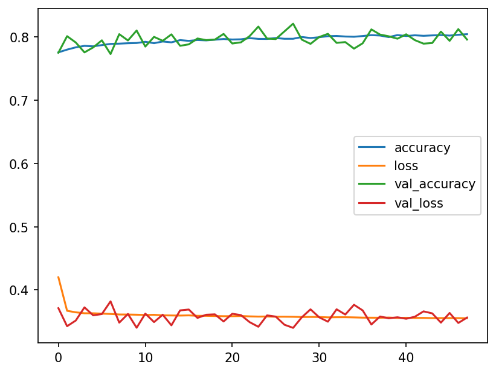
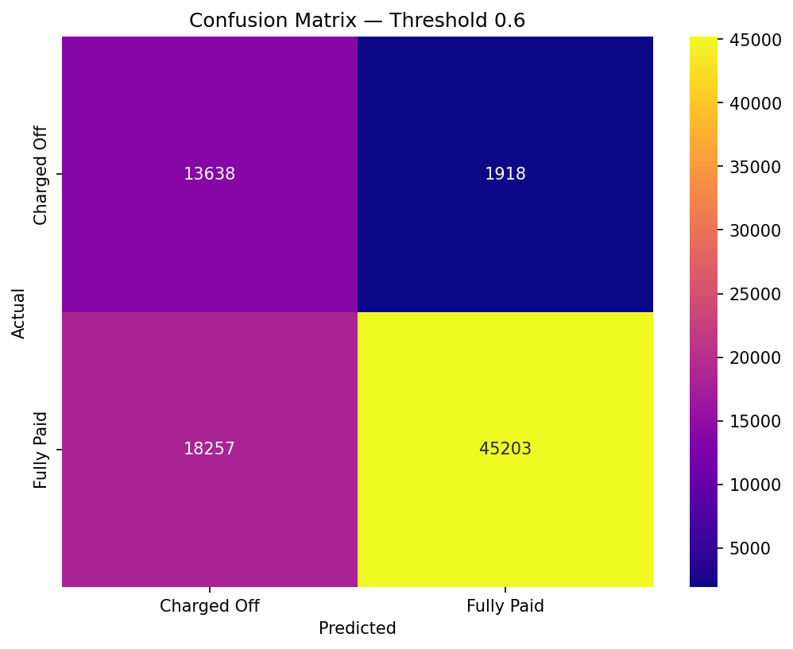
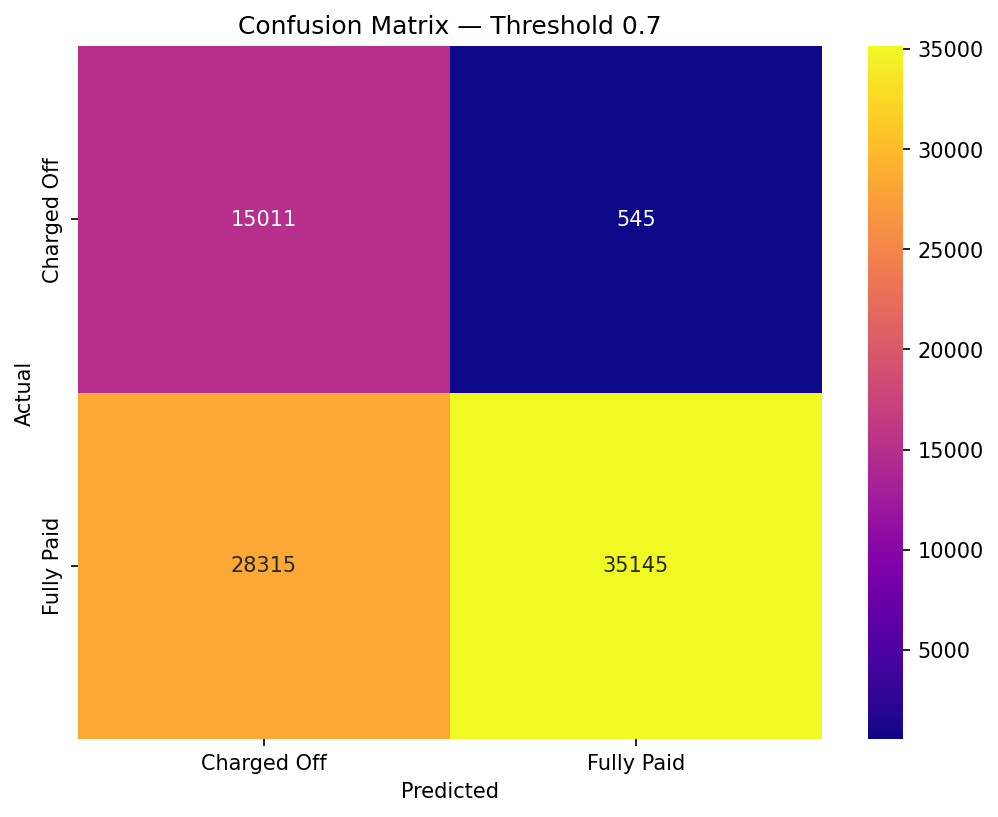
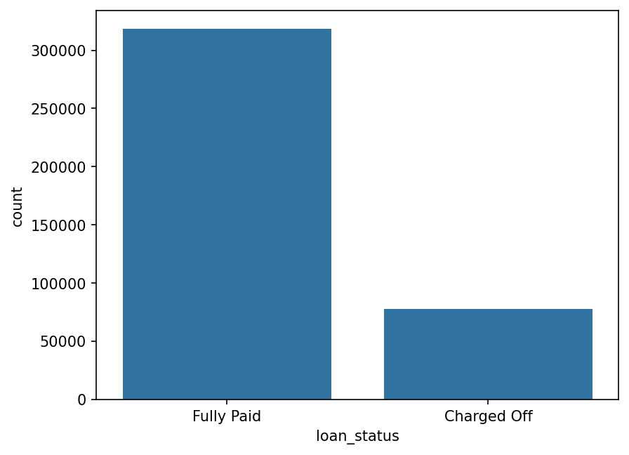
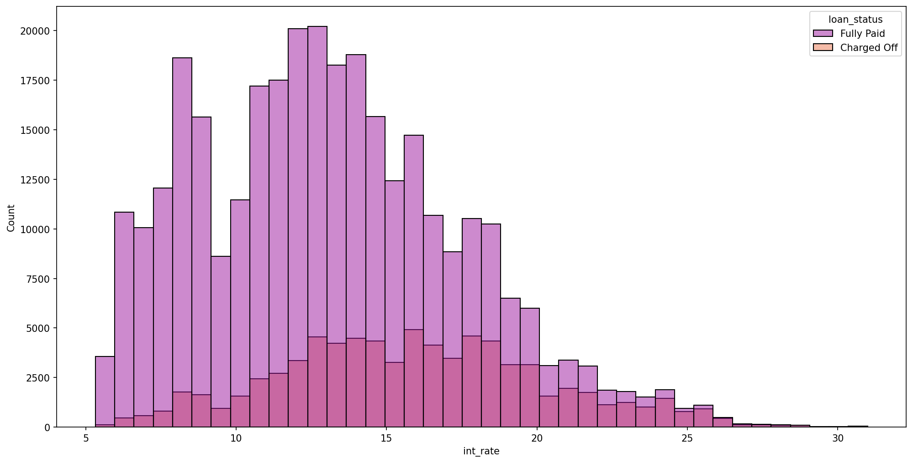
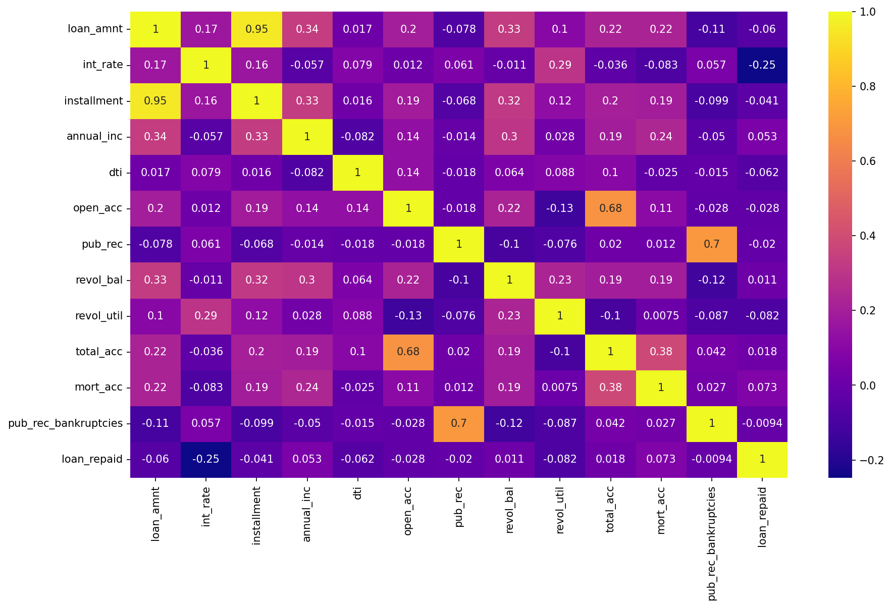
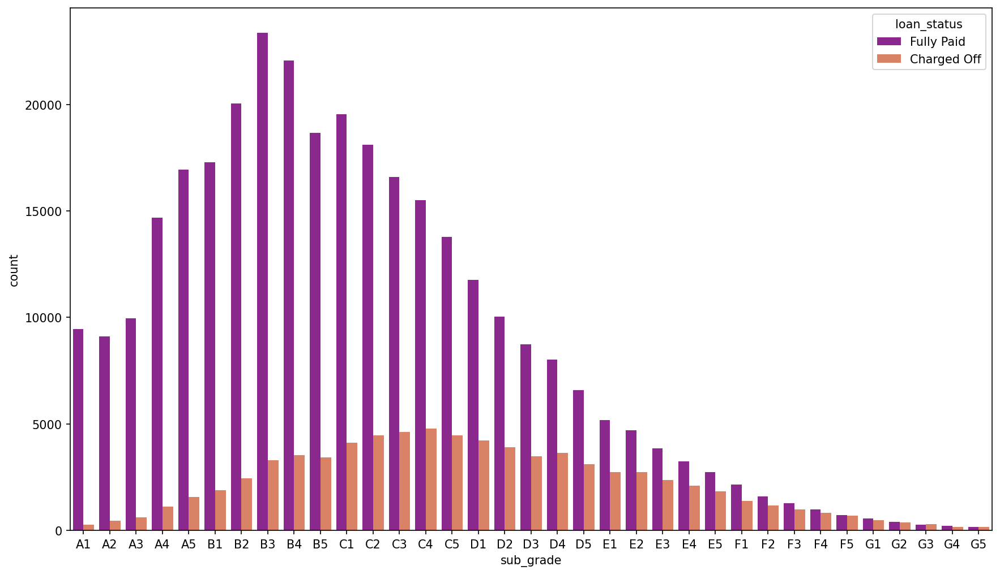

# Loan Default Prediction — LendingClub

Binary classification model to predict whether a borrower will fully repay or default on a loan, using historical data from LendingClub — a US peer-to-peer lending platform.

---

## Overview

In peer-to-peer lending, approving a loan that defaults is significantly more costly than rejecting a borrower who would have repaid. This project builds a neural network to classify loans as **Fully Paid** or **Charged Off**, and goes beyond standard evaluation by performing a **threshold analysis** grounded in business cost asymmetry.

---

## Dataset

- ~390,000 loan records with 27 features
- Target variable: `loan_status` (Fully Paid / Charged Off)
- Source: [LendingClub Dataset on Kaggle](https://www.kaggle.com/wordsforthewise/lending-club)

> The dataset is not included in this repository due to its size. Download it from Kaggle and place it in a `DATA/` folder before running the notebook.

---

## Project Structure

```
loan-default-prediction/
│
├── notebook.ipynb       # Full project: EDA, preprocessing, modeling, evaluation
├── README.md            
├── requirements.txt     
└── images/              # Exported plots used in this README
```

---

## Approach

### 1. Exploratory Data Analysis
- Target variable distribution — revealing significant class imbalance
- Interest rate distribution by loan status
- Feature correlation heatmap
- Default rate by subgrade (A1–G5)
- Employment length analysis — used to justify feature removal

### 2. Feature Engineering & Preprocessing
- Binary target variable creation (`loan_repaid`: 1 = Fully Paid, 0 = Charged Off)
- Removal of redundant, high-cardinality, and low-signal features
- Group-mean imputation for `mort_acc` using `total_acc`
- Data leakage prevention (`issue_d` dropped, scaler fit on train set only)
- Dummy encoding for categorical variables
- MinMax normalization

### 3. Neural Network (Keras/TensorFlow)
- Sequential architecture: Dense(78, ReLU) → Dense(39, ReLU) → Dropout(0.2) → Dense(19, ReLU) → Dropout(0.2) → Dense(1, Sigmoid)
- `class_weight` applied to handle class imbalance
- Early stopping to prevent overfitting

### 4. Threshold Optimization
Standard evaluation at threshold 0.5, followed by business-driven threshold analysis across 11 decision boundaries (0.2–0.8).

---

## Key Results

### Loss Curves


### Confusion Matrix — Threshold 0.6 (Conservative)


Captures **86% of actual defaults** while rejecting ~30% of good borrowers.

### Confusion Matrix — Threshold 0.7 (Aggressive)


Captures **95% of actual defaults** at the cost of rejecting ~42% of good borrowers.

---

## Threshold Decision — Business Rationale

A defaulted loan of $14,000 represents a total loss of principal. Rejecting a good borrower at the same amount foregoes ~$1,400 in interest revenue — a **10:1 cost asymmetry** that justifies a more aggressive threshold than the standard 0.5.

| Threshold | Default Recall | Good Borrowers Rejected | Recommended For |
|-----------|---------------|--------------------------|-----------------|
| 0.6       | 86%           | ~30%                     | Conservative strategy — preserves volume |
| 0.7       | 95%           | ~42%                     | Aggressive strategy — maximizes margin |

The default threshold of 0.5 is not recommended, as it underperforms on default capture without meaningfully protecting customer volume.

---

## EDA Highlights

### Target Distribution


### Interest Rate Distribution


### Correlation Heatmap


### Default Rate by Subgrade


---

## Stack

- **Language:** Python
- **Data:** Pandas, NumPy
- **Visualization:** Matplotlib, Seaborn
- **Modeling:** Scikit-learn, TensorFlow/Keras